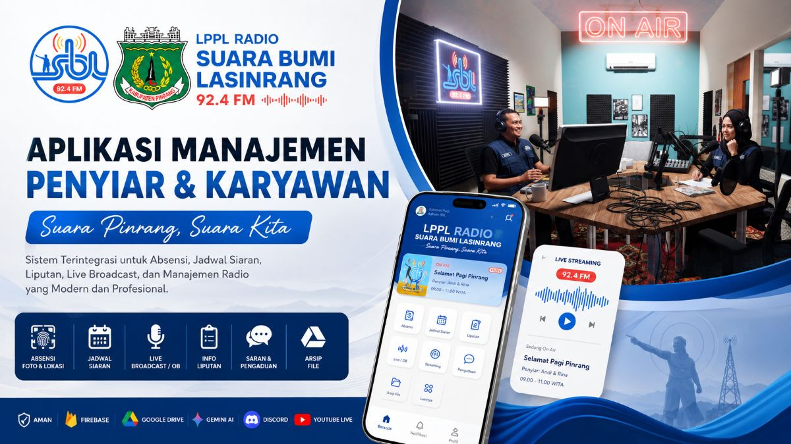
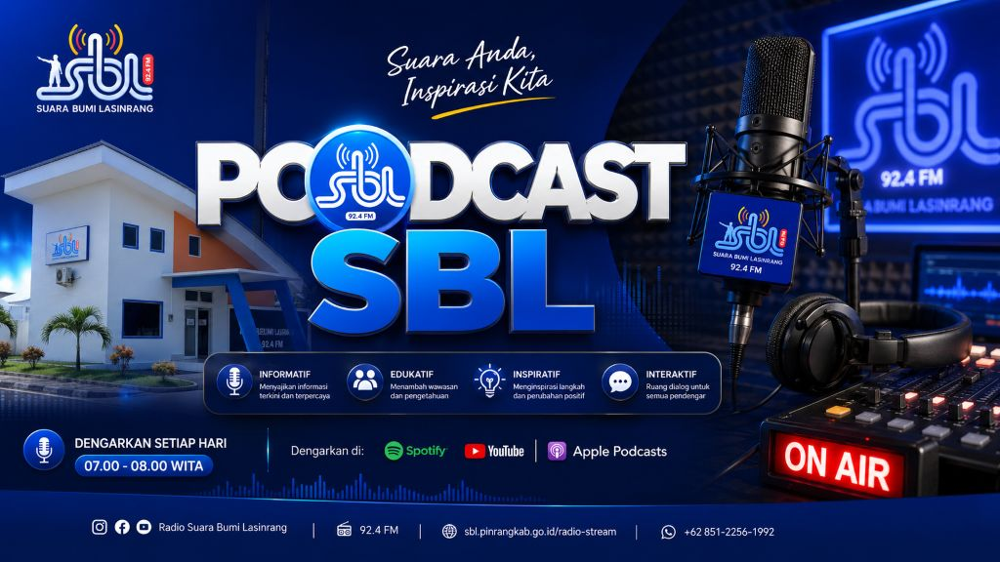

# Dokumentasi Lengkap Radio SBL Management System



Dokumen ini menjadi panduan utama untuk memahami, menjalankan, mengelola, dan
mengembangkan **Radio SBL Management System**. Aplikasi ini dibuat untuk
operasional LPPL Radio Suara Bumi Lasinrang 92,4 FM dengan pendekatan PWA,
mobile-first, dan terhubung ke layanan cloud.

## Identitas Aplikasi

| Item | Keterangan |
|---|---|
| Nama | Radio SBL Management System |
| Instansi | LPPL Radio Suara Bumi Lasinrang |
| Frekuensi | 92,4 FM |
| Tagline | Suara Pinrang, Suara Kita |
| Platform | Progressive Web App |
| Target perangkat | Android, desktop, dan browser modern |
| Repository | `https://github.com/sblfm2025/radiosbl` |
| Project Firebase | `radiosbl` |

## Ringkasan Sistem

Aplikasi ini menjadi pusat kendali digital untuk aktivitas radio harian:
absensi, jadwal siaran, profil penyiar, streaming, request lagu, liputan, OB,
pengaduan masyarakat, dan naskah siaran berbasis AI. Data utama disimpan di
Firestore, autentikasi memakai Firebase Auth, file dapat diarahkan ke Google
Drive/Firebase Storage, dan integrasi eksternal berjalan lewat service layer
atau proxy backend.

## Tampilan dan Aset Utama

| Logo aplikasi | Cover sosial | Background studio |
|---|---|---|
|  |  |  |

Gunakan aset visual sesuai panduan di
[PANDUAN_ASET_VISUAL.md](PANDUAN_ASET_VISUAL.md).

## Role Pengguna

| Role | Fungsi utama |
|---|---|
| `super_admin` | Kendali penuh sistem, rules, data pengguna, dan semua modul |
| `admin` | Validasi absensi, pengelolaan pengguna, jadwal, dan laporan |
| `pimpinan` | Monitoring dashboard, laporan, dan keputusan operasional |
| `penyiar` | Jadwal siaran, profil, request tukar jadwal, dan naskah AI |
| `reporter` | Penugasan liputan, dokumentasi lapangan, dan laporan |
| `operator` | Dukungan teknis siaran, streaming, dan OB |
| `karyawan` | Absensi dan profil pribadi |
| `publik` | Akses layanan publik seperti pengaduan atau informasi terbuka |

Detail hak akses ada di [ROLE_ACCESS.md](ROLE_ACCESS.md).

## Modul Aplikasi

### 1. Dashboard

Dashboard menampilkan ringkasan kondisi operasional: program aktif, status
streaming, absensi, request lagu, notifikasi, dan akses cepat sesuai role.
Dashboard menjadi halaman awal setelah login.

Alur dasar:

1. Pengguna login.
2. Sistem membaca profil dan role.
3. Dashboard memfilter menu dan data sesuai hak akses.
4. Pengguna masuk ke modul kerja yang tersedia.

### 2. Absensi

Modul absensi digunakan untuk mencatat kehadiran staf dengan lokasi dan foto.
Absensi mendukung validasi radius studio, status terlambat, status di luar
radius, serta review admin.

Fitur utama:

- Check-in dengan GPS.
- Selfie dari kamera perangkat.
- Validasi radius kantor/studio.
- Upload foto absensi ke storage.
- Rekap harian, mingguan, bulanan, dan tahunan.
- Review admin untuk status `needs_review`.
- Export laporan sesuai kebutuhan operasional.

Status absensi:

| Status | Arti |
|---|---|
| `present` | Hadir valid |
| `late` | Hadir terlambat |
| `outside_radius` | Check-in di luar radius |
| `needs_review` | Perlu validasi admin |
| `valid` | Disahkan admin |
| `rejected` | Ditolak admin |
| `sick` | Sakit |
| `leave` | Izin/cuti |

Dokumen pendukung: [ARAHAN_REKAP_ABSEN.md](ARAHAN_REKAP_ABSEN.md).

### 3. Jadwal Siaran

Modul jadwal siaran mengelola slot program, waktu tayang, penyiar, operator,
dan status program. Data jadwal menjadi rujukan untuk dashboard, profil
penyiar, dan informasi siaran aktif.

Fitur utama:

- Jadwal harian dan mingguan.
- Penempatan penyiar/operator.
- Data program siaran.
- Info program aktif berdasarkan waktu.
- Relasi ke foto program di `public/program`.

### 4. Tukar Jadwal

Penyiar dapat mengajukan tukar jadwal. Admin atau pihak terkait dapat meninjau
dan menyetujui sesuai alur internal.

Alur umum:

1. Penyiar memilih jadwal asal.
2. Penyiar memilih target tukar atau waktu pengganti.
3. Pengajuan masuk ke daftar review.
4. Admin memvalidasi.
5. Jadwal diperbarui dan riwayat disimpan.

### 5. Profil Penyiar dan Kru

Modul profil menampilkan identitas, role, nama udara, foto, dan relasi program.
Foto kru yang dipakai berada di `public/crew`.

Contoh galeri:

| Amar | Azhar | Hendra |
|---|---|---|
|  |  |  |

| Miah | Muhas | Ria |
|---|---|---|
|  |  |  |

### 6. Streaming

Modul streaming menyediakan pemutar radio, informasi siaran aktif, dan tampilan
waveform. Stream utama tidak boleh dicache oleh service worker agar audio tetap
real-time.

Komponen terkait:

- `AudioPlayer`
- `Waveform`
- `StreamingPage`
- `Shell` untuk mini player/global player

### 7. Request Lagu

Pendengar atau staf dapat mencatat request lagu. Data request dapat ditampilkan
ke penyiar/operator sebagai bahan interaksi siaran.

### 8. Liputan

Modul liputan membantu koordinasi reporter: penugasan, deskripsi tugas,
deadline, lokasi, upload dokumentasi, dan status progres.

Workflow yang disarankan:

| Status | Keterangan |
|---|---|
| `assigned` | Tugas diberikan |
| `in_progress` | Reporter sedang mengerjakan |
| `submitted` | Materi dikirim |
| `reviewed` | Diperiksa editor/admin |
| `published` | Siap/selesai dipublikasikan |

### 9. Live OB

Live OB atau Outside Broadcast dipakai untuk kegiatan siaran lapangan. Modul ini
mencatat event, lokasi, kru, rundown, checklist teknis, dan dokumentasi.

Integrasi pendukung:

- OBS Studio untuk produksi live.
- YouTube Live untuk distribusi video.
- Discord/komunikasi internal untuk koordinasi teknis.

### 10. Pengaduan Publik

Modul pengaduan menyediakan kanal aspirasi dan saran masyarakat. Admin dapat
melihat kategori, status, tindak lanjut, dan riwayat.

### 11. AI Naskah Siaran

Modul AI membantu penyiar membuat draft naskah siaran. Frontend tidak menyimpan
secret API; panggilan AI diarahkan ke endpoint proxy.

Konfigurasi umum:

```env
VITE_GEMINI_PROXY_ENDPOINT=
VITE_AI_SCRIPT_PROXY_ENDPOINT=
VITE_OPENAI_PROXY_ENDPOINT=
GEMINI_API_KEY=
GEMINI_API_KEYS=
OPENAI_API_KEY=
```

Secret hanya boleh berada di `.env.local`, Cloud Functions, atau backend aman.

### 12. Manajemen Pengguna

Admin dapat mengelola profil pengguna, role, status aktif, dan metadata staf.
Manajemen pengguna harus mengikuti rules Firestore agar tidak membuka akses
berlebihan.

## Galeri Program

Poster program sudah disesuaikan dari aset lokal di `public/program`. Gunakan
nama file stabil agar mudah direferensikan dari UI dan dokumentasi.

| Program | Poster |
|---|---|
| Aga Kareba |  |
| Informasi Seputar Pinrang |  |
| Info Terkini |  |
| Jumat Ceria |  |
| Lasinrang Preneur |  |
| Pinrang Berkabar |  |
| Pinrang Creative Network |  |
| Podcast SBL |  |
| Salam Bumi Lasinrang |  |
| SBL Goes To School |  |
| SBL On Stage |  |
| SBL Peduli |  |
| Siporio Siporennu |  |

## Struktur Folder Penting

```txt
.
├── public/
│   ├── crew/                 # Foto kru/penyiar
│   ├── program/              # Poster program
│   ├── logoapp.png           # Ikon aplikasi PWA
│   ├── coverSBL.jpg          # Cover social preview
│   └── sbl-auth-studio-bg.png
├── src/
│   ├── components/           # Halaman dan komponen UI
│   ├── data/                 # Data radio dan seed/mock
│   ├── lib/                  # Firebase/env helpers
│   ├── services/             # Service layer
│   ├── tests/                # Unit tests
│   ├── types/                # TypeScript domain types
│   └── utils/                # Utility
├── functions/                # Firebase Functions
├── scripts/                  # Script operasional
├── scratch/                  # Script sementara/admin lokal
└── docs/                     # Dokumentasi proyek
```

## Setup Lokal

Prasyarat:

- Node.js versi modern.
- npm.
- Firebase CLI jika ingin deploy.
- Browser modern.

Langkah:

```bash
npm install
Copy-Item .env.example .env.local
npm run dev
```

Isi `.env.local` sesuai layanan yang dipakai. Jangan commit `.env.local`.

## Environment

Kelompok variabel penting:

| Kelompok | Variabel |
|---|---|
| Firebase | `VITE_FIREBASE_API_KEY`, `VITE_FIREBASE_PROJECT_ID`, `VITE_FIREBASE_APP_ID`, `VITE_FIREBASE_STORAGE_BUCKET` |
| AI | `GEMINI_API_KEY`, `GEMINI_API_KEYS`, `OPENAI_API_KEY`, `VITE_*_PROXY_ENDPOINT` |
| WhatsApp | `WHATSAPP_CLOUD_API_TOKEN`, `WHATSAPP_PHONE_NUMBER_ID` |
| Google Drive | `GOOGLE_DRIVE_CLIENT_SECRET_PATH`, `GOOGLE_DRIVE_TOKEN_PATH`, `GOOGLE_DRIVE_ROOT_FOLDER` |
| Spotify/Podcast | `SPOTIFY_CLIENT_ID`, `SPOTIFY_CLIENT_SECRET`, `VITE_PODCAST_API_ENDPOINT` |

## Perintah NPM

| Perintah | Fungsi |
|---|---|
| `npm run dev` | Menjalankan Vite dev server |
| `npm run build` | Typecheck dan build production |
| `npm run typecheck` | Validasi TypeScript |
| `npm run test` | Unit test Vitest |
| `npm run test:e2e` | Playwright e2e |
| `npm run lint` | ESLint |
| `npm run check` | Lint, typecheck, test, build |
| `npm run proxy:notifications` | Proxy lokal WhatsApp/AI/Spotify |
| `npm run drive:auth` | OAuth Google Drive lokal |
| `npm run drive:server` | Server upload Google Drive lokal |
| `npm run functions:deploy` | Deploy Cloud Functions |

## Verifikasi

Untuk perubahan aplikasi:

```bash
npm run typecheck
npm run test
npm run build
```

Untuk perubahan dokumentasi/aset saja, minimal cek:

```bash
git status --short
git diff --check
```

Catatan: `npm run lint` masih bisa gagal bila ESLint memindai script scratch
atau file lama yang belum dirapikan.

## Deploy

Hosting:

```bash
npm run build
npx firebase-tools deploy --only hosting --project radiosbl
```

Firestore rules:

```bash
npx firebase-tools deploy --only firestore:rules --project radiosbl
```

Functions:

```bash
npm run functions:deploy
```

Functions memerlukan Firebase Blaze Plan.

## Keamanan

Aturan wajib:

- Jangan commit `.env`, `.env.local`, token OAuth, atau file
  `client_secret_*.json`.
- Jangan menaruh API key Gemini/OpenAI/WhatsApp langsung di frontend.
- Pakai proxy backend untuk secret.
- Rules Firestore harus membatasi data sesuai role.
- Rotasi secret jika pernah terlihat di screenshot, log, atau commit.

Referensi: [SECURITY_GUIDELINES.md](SECURITY_GUIDELINES.md).

## Data dan Koleksi Firestore

Koleksi utama yang dipakai sistem:

- `users`
- `userProfiles`
- `attendanceRecords`
- `scheduleSlots`
- `scheduleSwapRequests`
- `songRequests`
- `complaints`
- `coverageAssignments`
- `liveObEvents`
- `aiScriptDrafts`

Detail schema ada di [DATABASE_SCHEMA.md](DATABASE_SCHEMA.md).

## Panduan Pengembangan

Prinsip kerja:

- Ikuti pola service layer di `src/services`.
- Komponen UI tidak langsung memanggil API eksternal.
- Gunakan type domain dari `src/types/domain.ts`.
- Simpan aset publik di `public`.
- Catat perubahan besar di `docs/CODEX_SESSION_LOG.md`.
- Update `docs/HANDOFF.md` bila status proyek berubah signifikan.

## Troubleshooting

| Masalah | Solusi |
|---|---|
| Login gagal | Cek Firebase config, Auth provider, dan role user |
| Absensi tidak membaca lokasi | Izinkan permission lokasi browser dan gunakan HTTPS |
| Foto selfie gagal upload | Cek Storage/Drive endpoint dan aturan upload |
| AI tidak membalas | Cek endpoint proxy dan secret backend |
| Streaming tidak bunyi | Cek URL stream dan service worker cache |
| Build gagal | Jalankan `npm run typecheck`, baca error TypeScript pertama |
| Functions gagal deploy | Pastikan project Firebase sudah Blaze Plan |

## Dokumen Lanjutan

- [PROJECT_OVERVIEW.md](PROJECT_OVERVIEW.md)
- [FEATURE_SPECIFICATIONS.md](FEATURE_SPECIFICATIONS.md)
- [SYSTEM_ARCHITECTURE.md](SYSTEM_ARCHITECTURE.md)
- [DATABASE_SCHEMA.md](DATABASE_SCHEMA.md)
- [API_AND_SERVICES.md](API_AND_SERVICES.md)
- [DEPLOYMENT_GUIDE.md](DEPLOYMENT_GUIDE.md)
- [FIREBASE_SETUP.md](FIREBASE_SETUP.md)
- [GOOGLE_DRIVE_SETUP.md](GOOGLE_DRIVE_SETUP.md)
- [GEMINI_SETUP.md](GEMINI_SETUP.md)
- [ROLE_ACCESS.md](ROLE_ACCESS.md)
- [PANDUAN_ASET_VISUAL.md](PANDUAN_ASET_VISUAL.md)
