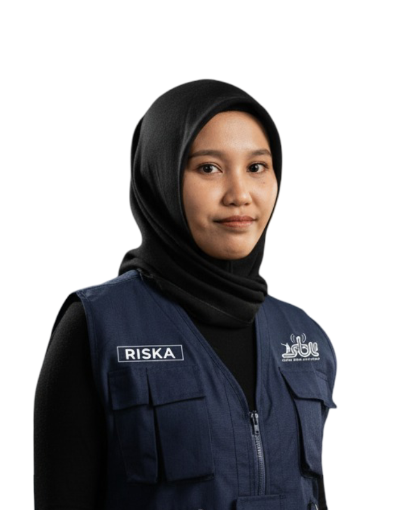
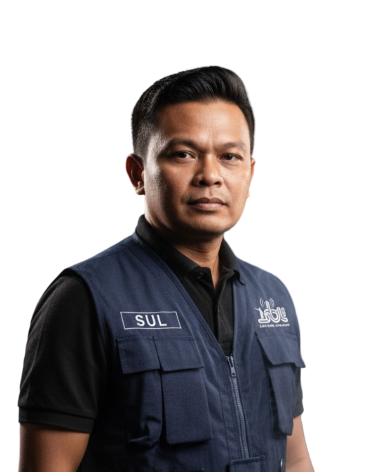
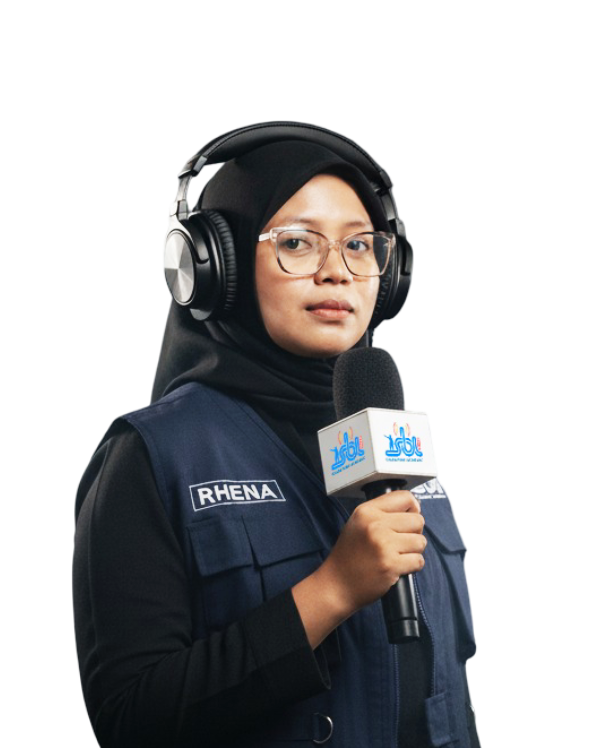

# Panduan Aset Visual Radio SBL

Dokumen ini menjelaskan penggunaan gambar, foto, poster program, dan aset
branding yang tersedia di folder `public`. Semua gambar di bawah sudah
disesuaikan agar dapat langsung dipakai di README, dokumentasi, PWA, dan UI.

## Prinsip Penggunaan

- Pakai aset dari `public` agar path stabil saat build Vite.
- Gunakan nama file tanpa spasi untuk aset baru.
- Foto kru disimpan di `public/crew`.
- Poster program disimpan di `public/program`.
- Cover utama dan logo disimpan langsung di `public`.
- Jangan menyimpan foto pribadi/sensitif tanpa izin.
- Kompres gambar sebelum commit bila ukurannya terlalu besar.

## Aset Branding

| File | Ukuran | Penggunaan |
|---|---:|---|
| `public/logoapp.png` | 512 x 512 | Ikon aplikasi, manifest PWA, favicon turunan |
| `public/coverSBL.jpg` | 1200 x 675 | Social preview utama |
| `public/coverartsbl.jpg` | 1200 x 675 | Cover alternatif dan dokumentasi |
| `public/sbl-auth-studio-bg.png` | 1536 x 1024 | Background login/auth |
| `public/background.png` | 1024 x 1024 | Background dekoratif lama |
| `public/radio_background.png` | 1024 x 1024 | Background radio alternatif |
| `public/iconSBL.svg` | SVG | Ikon/logo vektor lama |
| `public/LogoSBL.svg` | SVG | Logo SBL vektor |
| `public/LogoPinrang.svg` | SVG | Logo Pinrang vektor |

Preview:

| Logo | Cover | Studio |
|---|---|---|
|  |  |  |

## Poster Program

Poster program dipakai untuk kartu program, halaman jadwal, profil penyiar, dan
dokumentasi publik.

| Program | File | Preview |
|---|---|---|
| Aga Kareba | `public/program/Aga_Kareba.jpg` |  |
| Informasi Seputar Pinrang | `public/program/Informasi_Seputar_Pinrang.jpg` |  |
| Info Terkini | `public/program/Info_Terkini.jpg` |  |
| Jumat Ceria | `public/program/Jumat_Ceria.jpg` |  |
| Lasinrang Preneur | `public/program/Lasinrang_Preneur.jpg` |  |
| Pinrang Berkabar | `public/program/Pinrang_Berkabar.jpg` |  |
| Pinrang Creative Network | `public/program/Pinrang_Creative_Network.jpg` |  |
| Podcast SBL | `public/program/PODCAST_SBL.jpg` |  |
| Salam Bumi Lasinrang | `public/program/Salam_Bumi_lasinrang.jpg` |  |
| SBL Goes To School | `public/program/SBL_Goes_To_School.jpg` |  |
| SBL On Stage | `public/program/SBL_On_Stage.jpg` |  |
| SBL Peduli | `public/program/SBL_Peduli.jpg` |  |
| Siporio Siporennu | `public/program/Siporio_Siporennu.jpg` |  |

Rekomendasi tampilan UI:

- Kartu program landscape: `aspect-ratio: 16 / 9`.
- Kartu poster portrait: gunakan `object-fit: cover` dan crop tengah.
- Jangan menaruh teks penting UI di atas poster tanpa overlay kontras.
- Untuk README/dokumentasi, batasi ukuran tampilan dengan tabel agar halaman
  tidak terlalu panjang.

## Foto Kru

Foto kru dipakai untuk profil penyiar, manajemen pengguna, dan dokumentasi.
File saat ini berformat PNG dengan rasio portrait.

| Nama | File | Preview |
|---|---|---|
| Amar | `public/crew/amar.png` |  |
| Azhar | `public/crew/azhar.png` |  |
| Hendra | `public/crew/hendra.png` |  |
| Miah | `public/crew/Miah.png` |  |
| Muhas | `public/crew/muhas.png` |  |
| Ria | `public/crew/ria.png` |  |
| Riska | `public/crew/riska.png` |  |
| Sul | `public/crew/sul.png` |  |
| Wiwik | `public/crew/wiwik.png` |  |

Rekomendasi tampilan UI:

- Avatar bulat: gunakan `object-fit: cover`, `object-position: center top`.
- Profil lengkap: gunakan rasio `4 / 5` atau `3 / 4`.
- Hindari crop terlalu ketat pada wajah.
- Bila menambah foto baru, gunakan nama file lowercase tanpa spasi.

## Path di React/Vite

Karena aset berada di `public`, path yang dipakai dari browser diawali `/`.

Contoh:

```tsx


```

Untuk Markdown dari root repo:

```md

```

Untuk Markdown dari folder `docs`:

```md

```

## Rekomendasi Aset Baru

Jika perlu membuat atau generate aset baru, gunakan standar berikut:

| Kebutuhan | Ukuran disarankan | Format |
|---|---:|---|
| Cover social preview | 1200 x 675 | JPG/WebP |
| Poster program landscape | 1024 x 576 atau 1200 x 675 | JPG/WebP |
| Poster program portrait | 1024 x 1161 atau 1080 x 1350 | JPG/WebP |
| Background login | 1536 x 1024 atau 1920 x 1280 | JPG/WebP |
| Ikon PWA | 512 x 512 | PNG |
| Foto kru | 800 x 1000 atau 1024 x 1280 | PNG/JPG |

Prompt dasar untuk generate poster program:

```txt
Create a polished radio program poster for LPPL Radio Suara Bumi Lasinrang 92,4 FM.
Use a modern local public-radio identity, clear broadcast energy, and a clean layout.
Keep enough safe space for the program title.
No fake sponsor logos, no unreadable small text, no watermark.
```

Prompt dasar untuk generate background login:

```txt
Create a realistic modern radio studio background for a public radio management web app.
Warm professional lighting, mixing console, microphone, broadcast room atmosphere.
No visible brand logos, no people, no text, no watermark.
```

## Checklist Sebelum Commit Aset

- File bisa dibuka normal.
- Nama file stabil dan tidak memakai spasi.
- Ukuran file wajar untuk web.
- Path sudah dipakai di dokumentasi atau UI.
- Aset sensitif sudah mendapat izin.
- Tidak ada token, metadata rahasia, atau screenshot berisi secret.
