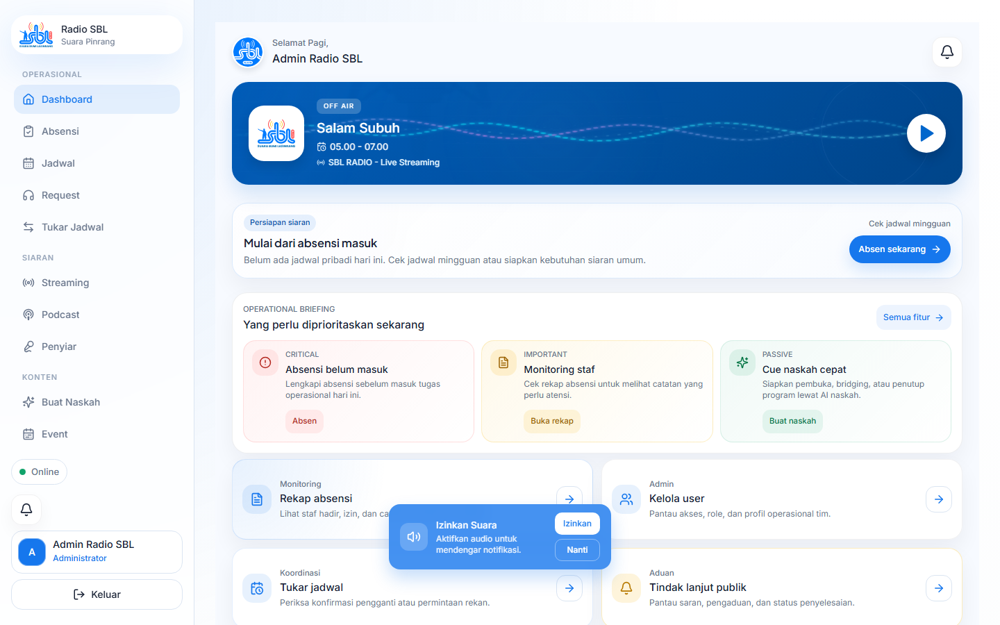
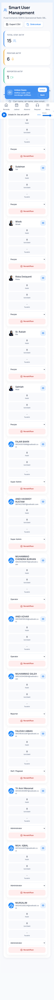
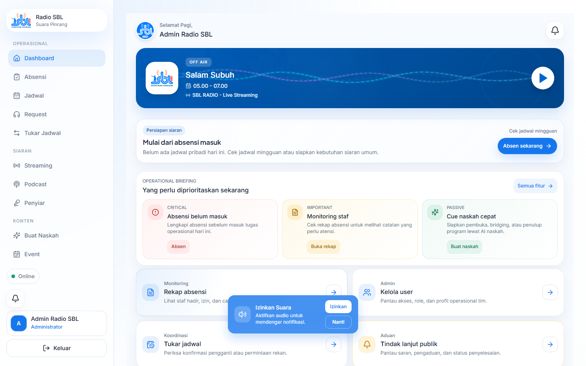

# Panduan Admin

## Fungsi
Panduan ini membantu admin memantau operasional, mengelola user, jadwal, absensi, aduan, dan laporan.

## Cara Mengakses
Login sebagai admin/super admin. Menu administrasi tersedia melalui sidebar desktop atau `Menu` di mobile.

## Workflow Utama
1. Buka `Dashboard` untuk melihat briefing, rekap, dan aksi penting.
2. Buka `Kelola User` untuk mengatur role, status aktif, dan profil.
3. Buka `Rekap Absen` untuk memantau kehadiran, izin, dan validasi.
4. Buka `Jadwal` untuk edit slot aktual bila diperlukan.
5. Buka `Aduan` untuk memproses laporan publik.
6. Buka `Tukar Jadwal` untuk memantau alur pertukaran penyiar.

## Contoh Screenshot

## Catatan Penting
- Jangan mengubah role tanpa persetujuan internal.
- Validasi absensi harus memakai bukti lokasi, selfie, dan catatan AI.
- Data sensitif tidak boleh masuk dokumentasi atau screenshot publik.

## Troubleshooting
| Masalah | Solusi |
| --- | --- |
| User tidak bisa login | Cek status aktif dan role user. |
| Absensi perlu review | Buka detail rekap dan validasi manual. |
| Edit jadwal tidak tersimpan | Cek koneksi dan permission admin. |

