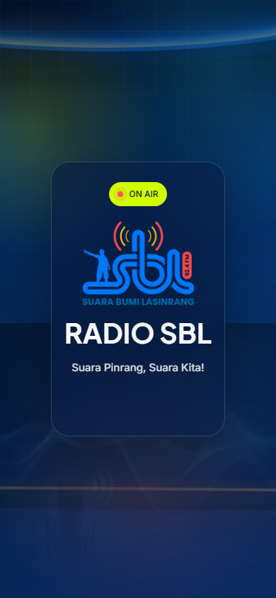
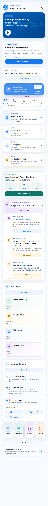
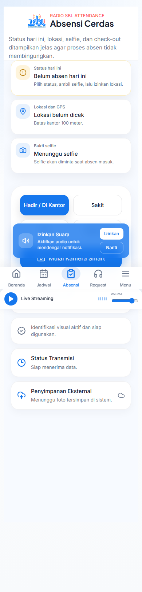
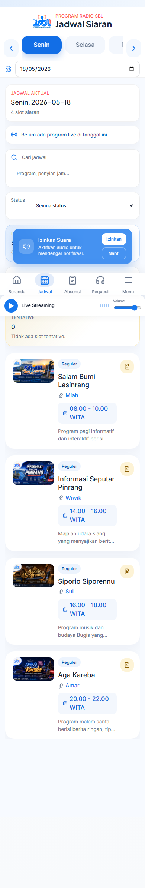
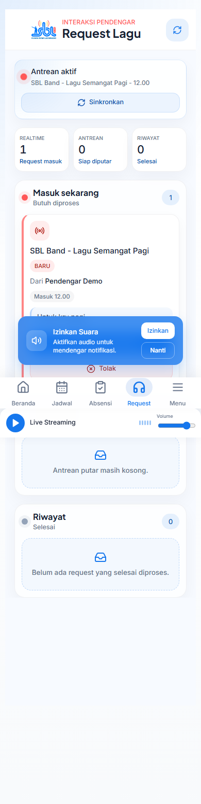
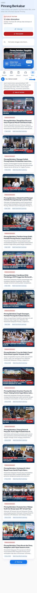
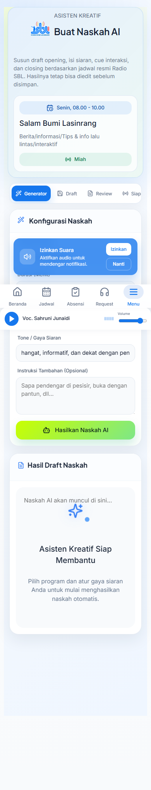
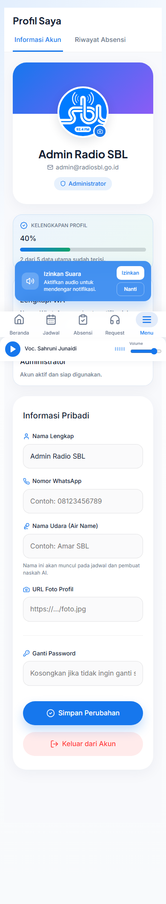

# Panduan Pengguna RadioSBL App

## Fungsi
Panduan ini membantu pengguna baru memahami RadioSBL App sebagai pusat kerja operasional radio: dashboard, absensi, jadwal, request lagu, streaming, podcast, pengaduan, dan profil.

## Siapa yang Menggunakan
- Penyiar
- Admin
- Reporter
- Operator
- Staf internal

## Cara Mengakses
1. Buka aplikasi RadioSBL App.
2. Login dengan akun yang diberikan admin.
3. Gunakan menu bawah di mobile atau sidebar di desktop.

## Fitur Utama

### Login
Masukkan email atau nomor WA dan kata sandi yang diberikan oleh admin.

### Dashboard
Dashboard menampilkan status siaran, briefing operasional, request terkini, aksi cepat, dan aktivitas terbaru sesuai role.

### Absensi
Gunakan menu `Absensi` untuk check-in, upload selfie, melihat status lokasi, dan check-out setelah selesai bertugas.

### Jadwal Siaran
Gunakan menu `Jadwal` untuk melihat slot hari ini, mencari program, membuka detail program, atau melanjutkan ke naskah/request/streaming.

### Request Lagu
Gunakan menu `Request` untuk melihat request masuk, antrean, dan riwayat. Penyiar dapat memproses request ke antrean atau menandai selesai.

### Pinrang Berkabar
Gunakan menu `Pinrang Berkabar` di grup Konten untuk menonton video terbaru dari playlist YouTube resmi langsung di dalam aplikasi. Pilih kartu video untuk memutar di player halaman; tombol `Buka di YouTube` tetap tersedia sebagai opsi luar.

### Buat Naskah AI
Gunakan menu `Naskah AI` untuk membuat draft pembuka, bridging, cue, dan penutup siaran.

### Profil Pengguna
Gunakan menu `Profil` untuk memperbarui data pribadi, kontak operasional, dan melihat riwayat.

## Catatan Penting
- Jangan membagikan akun kepada orang lain.
- Jangan menyimpan token, password, atau konfigurasi sistem di dokumentasi.
- Jika data tidak muncul, cek koneksi atau hubungi admin.

## Troubleshooting
| Masalah | Solusi |
| --- | --- |
| Tidak bisa login | Pastikan email/password benar dan akun aktif. |
| Absensi gagal | Izinkan akses lokasi/kamera dan coba ulang. |
| Jadwal kosong | Pilih tanggal lain atau hubungi admin. |
| Request tidak masuk | Cek koneksi internet atau buka ulang halaman Request. |

## FAQ
**Apakah aplikasi bisa dipakai di HP?**  
Bisa. UI utama dibuat mobile-first.

**Apakah data panduan aman?**  
Ya, dokumentasi dan screenshot memakai data contoh yang tidak berisi data pribadi.
